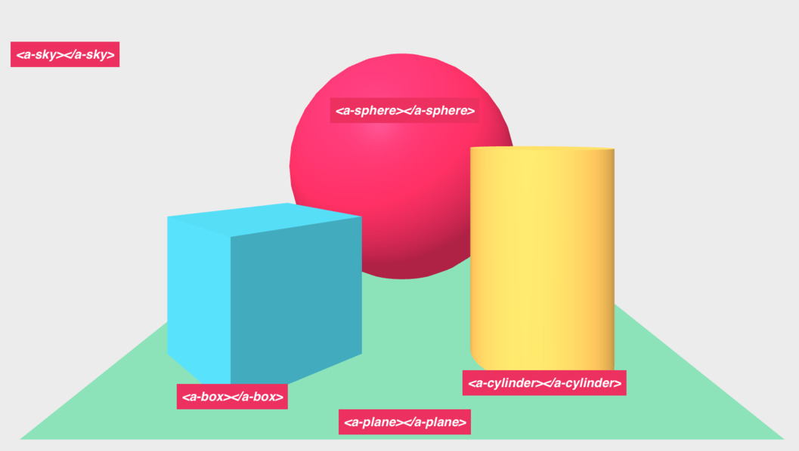

# 📚 Introduccion a A-Frame

A-Frame es un framework web de código abierto para crear experiencias de realidad virtual. Basado en HTML, A-Frame fue diseñado para ser aprendido y adoptado fácilmente, pero mas allá de su sencillez, el core es un poderoso sistema bajo el modelo de [Entidad-Componente](#point_right-aclaraciones) que proporciona una estructura declarativa, extensible y de fácil composición usando [three.js](#point_right-aclaraciones).

## :boom: Features

:eyeglasses: **Realidad virtual al alcance de todos**: A-Frame maneja por nosotros todo lo necesario para crear ambientes 3D y de realidad virtual
en múltiples plataformas, desde móviles y desktop hasta headsets mas avanzados como HTC Vive y Occulus Rift.

:ok_hand: **HTML Declarativo**: Funciona con etiquetas de tipo HTML, fáciles de leer y usar por cualquier persona!

:electric_plug: **Arquitectura Entidad-Componente**: A-Frame es un framework muy potente, proporciona una estructura declarativa, extensible y de componentes
reutilizables. Gracias a que funciona con HTML, tenemos acceso ilimitado a Javascript, APIs, three.js, WebVR y WebGL.

:zap: **Rendimiento**: A-Frame esta optimizado desde cero para WebVR. Usa HTML, así que los elementos personalizados no tocan para nada los motores de render del navegador. Todas las llamadas y cambios a objetos 3D se hacen bajo cuerdas con un simple `requestAnimationFrame` en memoria.

🤝 **Compatibilidad**: A-Frame trabaja con JavaScript, así que es compatible con frameworks y librerías como React, Vue, Preact, D3, Ember, e incluso JQuery!

:mag: **Inspector visual**: A-Frame cuenta con un inspector visual 3D con herramientas para desarrolladores con una interfaz similar a Unity.
 Abre cualquier escena y presiona `<ctrl> + <alt> + i`.

:package: **A-Frame Registry**: Puedes reutilizar componentes creados y compartidos por otros miembros de la comunidad. [A-Frame Registry](https://aframe.io/aframe-registry) almacena componentes de una forma similar a Unity Asset Store.

:runner: **Vamos!**: Puedes empezar con los componentes incorporados en A-Frame, desde figuras geométricas, texturas, animaciones, luces y sombras, hasta controles
y audio posicional.

## :wave: Hello VR!

La manera mas fácil de empezar a usar A-Frame es usando algún editor de código online ([JSFiddle](https://jsfiddle.net) o [Codepen](https://codepen.io)).

1. Lo primero que necesitamos, es cargar la libreria de A-Frame. Actualmente, la última versión es la 0.7.1.
```html
 <script src="https://aframe.io/releases/0.7.1/aframe.min.js"></script>
 ```

 2. Ahora debemos crear una escena de A-Frame, donde incluiremos todos los elementos que compondrán nuestra experiencia de realidad virtual.
 ```html
<a-scene>
  <!-- Acá van todos los componentes que incluiremos en nuestra escena -->
</a-scene>
 ```
 3. A continuación, dentro del tag a-scene, vamos a incluir algunos de los elementos estándar de A-Frame, llamados Primitivas. Empezaremos usando `<a-box>` como un elemento tradicional de HTML, definiendo el tag y usando atributos HTML para personalizarlo. En este ejemplo, vamos a definir el color, la posición y la rotación de la caja. Puedes revisar la documentación oficial del [a-box](https://aframe.io/docs/0.7.0/primitives/a-box.html) para ver la lista completa de atributos.

 ```html
<a-scene>
  <a-box position="-1 0.5 -3" rotation="0 45 0" color="#4CC3D9"></a-box>
</a-scene>
 ```

4. Otras de las primitivas mas comunes que vienen incluidas en A-Frame son `<a-sphere>`, `<a-cylinder>`, `<a-plane>` o `<a-sky>`. Que tal si las añadimos a nuestra escena:

````html
<a-scene>
  <a-sphere position="0 1.25 -5" radius="1.25" color="#EF2D5E"></a-sphere>
  <a-box position="-1 0.5 -3" rotation="0 45 0" width="1" height="1" depth="1" color="#4CC3D9"></a-box>
  <a-cylinder position="1 0.75 -3" radius="0.5" height="1.5" color="#FFC65D"></a-cylinder>
  <a-plane position="0 0 -4" rotation="-90 0 0" width="4" height="4" color="#7BC8A4"></a-plane>
  <a-sky color="#ECECEC"></a-sky>
</a-scene>
````

Acabamos de crear nuestra primera escena de realidad virtual! Repasemos un poco lo que acabamos de hacer:

1. Lo primero que hicimos fue crear una escena de realidad virtual utilizando el tag `<a-scene>`. Esta va a ser la etiqueta padre de nuestra escena de VR, es similar al body en un documento HTML, contiene todas las entidades que componen nuestra escena.

`<a-scene>` controla toda la configuración requerida para 3D: Preparar [WebGL](#point_right-aclaraciones), el canvas, la cámara, la iluminación y el proceso de render en el navegador, así como el soporte para plataformas como HTC Vive, Oculus Rift, Samsung GearVR, y smartphones a través de Google Cardboard.

2. Luego añadimos algunos elementos a la escena. Estos elementos, llamados primitivas, envuelven el patrón de Entidad-Componente en unos simples tags HTML de forma que sean muy fáciles de utilizar por los usuarios del framework. Como veremos más adelante, es posible crear nuestras propias primitivas.

<p align="center">
 
</p>

3. Ya construimos nuestra escena e incluímos algunos elementos en ella. Pero, cómo funciona realmente el modelo de entidades en 3 dimensiones?

Empecemos por el espacio en 3D. A-Frame un sistema de coordenadas diestro. Es decir, que la dirección por defecto de la cámara indica que el eje X positivo es a la derecha, el eje Y positivo es hacia arriba, y el eje Z positivo es en dirección nuestra, saliendo de la pantalla hacia nosotros.

<p align="center">
 
</p>

A-Frame mide la distancia en metros debido a que el [API de WebVR](https://developer.mozilla.org/es/docs/Web/API/WebVR_API) retorna los datos de posición en metros.
De esta manera, es importante que cuando creemos nuestras escenas de VR, tengamos en cuenta esta escala, ya que en la pantalla un tamaño determinado pueda verse bien, pero en realidad virtual tal vez sea muy grande para los usuarios.

Finalmente, la unidad de rotación en A-Frame son los grados, aunque internamente, el framework los convierte a radianes para pasarlos por three.js. Así pues, para trasladar, rotar y escalar un componente, debemos especificar sus atributos de posición, rotación y escala.


___
### :point_right: Aclaraciones
> Entity-Component System: La arquitctura ECS es un patrón común en 3D y desarrollo de videojuegos, siguiendo el principio de composición por sobre la herencia y la jerarquía. Entity hace referencia a objetos que por sí solos no hacen nada, pero que cuando se les agrega cierta funcionalidad, van a formar parte del mundo que se esta creando. Funciona como un contenedor. Component, por su parte, se refiere a módulos reutilizables que se aplican a las entidades para darles cierta funcionalidad y comportamiento. Finalmente, System, provee el scope global a través del conocimiento total del sistema, desde el manejo de la información que se pasa a los componentes, hasta el manejo de clases los mismos.

> WebGL: Es la especificación estádar que define el API en javascript que controla el render de gráficas 3D en los navegadores web.

> Three.js: Es una librería de javascript especializada en crear y visualizar gráficas en 3D. Es open source y se puede combinar con elementos de tipo Canvas en HTML, SVG o WebGL.

### 📝 [Solución](https://codepen.io/fabiojcortes/pen/aLxjEo)
