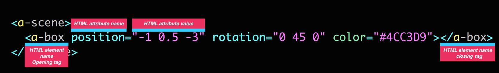

# :dragon_face: Primitivas

A-Frame nos provee ciertos elementos estándar llamados primitivas, que envuelven el patrón de Entidad-Componente en unos simples tags HTML de forma que sean muy fáciles de utilizar por los usuarios del framework.

Estas Primitivas funcionan de igual manera que los tags HTML tradicinales, tienen un tag de apertura, unos atributos y un tag de cierre:

<p align="center">
 
</p>

A-Frame contiene primitivas que nos permiten crear mallas, renderizar contenido 3D, personalizar el ambiente de la escena e incluso ubicar la cámara.

## :see_no_evil: Tras bambalinas

Las primitivas funcionan como una capa de abstracción  mas alta mientras nos familiarizamos con el framework, ya que tras bambalinas no son mas que entidades `<a-entity>` que:

* Tienen un nombre semántico, por ejemplo: `<a-sphere>`
* Tienen un conjunto preestablecido de componentes con valores predeterminados
* Mapean atributos HTML a los datos del componente

Si has trabajado en Unity, las primtivas son similares a los [prefabs](https://docs.unity3d.com/Manual/Prefabs.html).

Para A-Frame, un `<a-box>` con estos atributos:

```html
 <a-box color="red" width="3"></a-box>

 No es mas que:

```html
<a-entity geometry="primitive: box; width: 3" material="color: red"></a-entity>

 De esta manera, A-Frame mapea los atributos HTML con las  respectivas propiedades del elemento tridimensional.

En nuestro primer ejercicio utilizamos algunas primitivas, qué tal si creamos otra escena con diferentes elementos?.

Recuerda que lo primero que debemos hacer, es agregar el script de A-Frame antes de la escena 3D:

```html
<script src="https://aframe.io/releases/0.7.1/aframe.min.js"></script>

<a-scene>

</a-scene>

Ahora, agreguemos un plano y un cielo para darle cierto ambiente a la escena:

```html
<a-plane position="0 0 -8" rotation="-90 0 0" width="8" height="4" color="peru"></a-plane>
<a-sky color="skyblue"></a-sky>

Finalmente, agregaremos 4 elementos: [Torus](https://aframe.io/docs/0.7.0/primitives/a-torus.html), [Torus-Knot](https://aframe.io/docs/0.7.0/primitives/a-torus-knot.html), [Octahedron](https://aframe.io/docs/0.7.0/primitives/a-octahedron.html), [Cone](https://aframe.io/docs/0.7.0/primitives/a-cone.html):

```html
<a-torus position="0 0 -8" color="#213041" arc="360" radius="4.5" radius-tubular="0.1"></a-torus>
<a-torus-knot position="0 2 -8" color="#B84A39" arc="180" p="2" q="7" radius="1" radius-tubular="0.1"></a-torus-knot>
<a-octahedron position="-2 1 -6" rotation="0 45 0" color="#FF926B" radius="1"></a-octahedron>
<a-cone position="2 1 -6" rotation="-90 25 0" color="green" radius-bottom="0" radius-top="0.5"></a-cone>

### 📝 [Solución](https://codepen.io/fabiojcortes/pen/VrMPOm)
