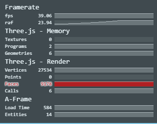

# :clapper: La escena

En los ejercicios anteriores, vimos que para crear una escena de VR, debíamos utilizar el elemento `<a-scene>`. Pues bien, la escena o [a-scene](https://aframe.io/docs/0.7.0/core/scene.html) no es mas que la raíz u objeto global y en allí, estan empaquetadas todas las entidades necesarias para darle vida a nuestra experiencia de VR.

`<a-scene>` como su nombre lo indica, es análoga a una escena en cine o teatro. Contiene la cámara, la configuración de las luces, la interfaz de usuario para entrar en modo VR y el sistema de componentes que la componen. Así pues, este elemento maneja por nosotros toda la configuración necesaria para poner en movimiento la escena de VR:

* Canvas, renderer y render loop
* Cámara e iluminación por defecto
* Configura los polyfill necesarios para que la escena de VR corra en nuestros dispositivos
* Agrega la interfaz de usuario necesaria para entrar en modo VR

## :microscope: Características principales

La escena tiene sus propios eventos, métodos, propiedades y componentes. A continuación veremos los principales componentes, toda la información la puedes encontrar en la documentación oficial del elemento [a-scene](https://aframe.io/docs/0.7.0/core/scene.html).

En este punto, vamos a utilizar la escena que creamos en el ejercicio anterior para analizar los componentes propios de la escena. Recuerda que por ahora estamos utilizando un editor de código online como [JSFiddle](https://jsfiddle.net) o [Codepen](https://codepen.io).

```html
<script src="https://aframe.io/releases/0.7.1/aframe.min.js"></script>

<a-scene>
  <a-plane position="0 0 -8" rotation="-90 0 0" width="8" height="4" color="peru"></a-plane>
  <a-torus position="0 0 -8" color="#213041" arc="360" radius="4.5" radius-tubular="0.1"></a-torus>
  <a-torus-knot position="0 2 -8" color="#B84A39" arc="180" p="2" q="7" radius="1" radius-tubular="0.1"></a-torus-knot>
  <a-octahedron position="-2 1 -6" rotation="0 45 0" color="#FF926B" radius="1"></a-octahedron>
  <a-cone position="2 1 -6" rotation="-90 25 0" color="green" radius-bottom="0" radius-top="0.5"></a-cone>
  <a-sky color="skyblue"></a-sky>
</a-scene>
````

### :bar_chart: Stats
El componente [stats](https://aframe.io/docs/0.7.0/components/stats.html) nos muestra ciertas métricas relacionadas con el rendimiendo de nuestra escena de VR. Estas métricas corresponden únicamente al elemento `<a-scene>`.

<p align="center">
 
</p>

Para activarlo, lo único que debemos hacer es incluir la palabra 'stats' dentro del tag de la escena:

```html
<a-scene stats>
  ...
  ...
</a-scene>
````
Estas son las métricas que nos muestra el componente stats:
* fps: Frames per second, framerate.
* requestAnimationFrame (raf): Latencia
* Textures: Número de [texturas](#point_right-aclaraciones) de three.js en la escena. Un número bajo, indica que la escena está usando poca memoria y enviando poca información a la [GPU](#point_right-aclaraciones).
* Programs: Número de [Shaders](#point_right-aclaraciones) GLSL en la escena
* Geometries: Número de [geometrias](#point_right-aclaraciones) de three.js en la escena. Un número bajo, indica que la escena está usando poca memoria.
* Vertices: Número de [vértices](#point_right-aclaraciones) en la escena.
* Faces: Número de [faces](#point_right-aclaraciones) en la escena.
* Calls: Número de llamados a dibujar en cada frame de la escena.
* Load time: Tiempo en ms que le toma a la escena empezar el render.
* Entities: Número de entidades de A-Frame.

### :eyeglasses: VR mode UI

### :foggy: Fog


___
### :point_right: Aclaraciones
>Texturas

>GPU

>Shaders

>Geometrias

>Vértices

>Faces
