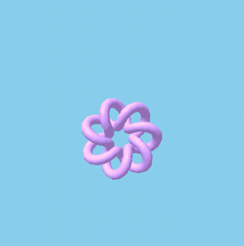
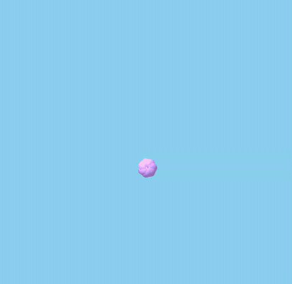

# :collision: Animación

Para agregar animaciones a nuestras escenas en A-Frame, debemos agregar el elemento `<a-animation>` como 'hijo' de la entidad que queramos animar.

Vamos a ver como funcionan las animaciones con un ejemplo sencillo. Empezaremos definiendo un `<a-torus-knot>` y un `<a-sky>` dentro de nuestra escena:

```html
<a-scene>
  <a-torus-knot position="0 2 -6" color="#C699F7" arc="180" p="2" q="7" radius="1" radius-tubular="0.1"></a-torus-knot>
  <a-sky color="skyblue"></a-sky>
</a-scene>
````

Una vez definidos estos componentes, debemos incluir el elemento `<a-animation>` como 'hijo' del cual queremos animar, en este caso, el torus-knot. Dentro de este tag, debemos especificar los detalles de nuestra animación, empezando por el atributo que queremos animar, así como los valores sobre los que vamos a hacer la transición.

Para empezar, vamos a animar la posición del elemento y con una duración de 3 segundos, vamos a moverlo desde la posición inicial "0 2 -8" hasta "0 2 -3".

```html
<a-scene>
  <a-torus-knot position="0 2 -8" color="#C699F7" arc="180" p="2" q="7" radius="1" radius-tubular="0.1">
    <a-animation attribute="position" dur="3000" from="0 2 -8" to="0 2 -3" > </a-animation>
  </a-torus-knot>
  <a-sky color="skyblue"></a-sky>
</a-scene>
````

Al correr el programa, deberíamos ver lo siguiente:

<p align="center">
 
</p>

Ya tenemos una primera animación para nuestro elemento, pero esta solo ocurre una vez al cargar el programa. Utilizando el atributo `repeat`, podemos especificar cuantas veces debe correr la animación o si queremos que se haga de manera infinita con `repeat="indefinite"`. También vamos a agregar un pequeño delay, para que la animación empiece 2 segundos después de que el programa arranque con `begin="2000"`.

```html
<a-scene>
  <a-torus-knot position="0 2 -8" color="#C699F7" arc="180" p="2" q="7" radius="1" radius-tubular="0.1">
    <a-animation attribute="position" dur="3000" from="0 2 -8" to="0 2 -3" begin="2000" repeat="indefinite"> </a-animation>
  </a-torus-knot>
  <a-sky color="skyblue"></a-sky>
</a-scene>
````

Ahora al correr el programa, deberíamos ver lo siguiente:

<p align="center">
 
</p>

Ahora nuestro elemento se anima de forma infinita, sin embargo, se ve un poco forzado el inicio de la animación, ya que el torus-knot vuelve a la posición inicial para volver a comenzar. Esto lo podemos arreglar con el atributo `direction` de la siguiente manera:

```html
<a-scene>
    <a-torus-knot position="0 2 -8" color="#C699F7" arc="180" p="2" q="7" radius="1" radius-tubular="0.1">
      <a-animation attribute="position" dur="3000" from="0 2 -8" to="0 2 -3" repeat="indefinite" direction="alternate" > </a-animation>
    </a-torus-knot>
    <a-sky color="skyblue"> </a-sky>
</a-scene>
````

<p align="center">
 
</p>

Ahora bien, si deseamos animar otra propiedad de nuestro elemento, basta con agregar otro `<a-animation>` con sus respectivos atributos. A continuación animaremos la rotación del elemento:

```html
<a-scene>
    <a-torus-knot position="0 2 -8" color="#C699F7" arc="180" p="2" q="7" radius="1" radius-tubular="0.1">
      <a-animation attribute="position" dur="3000" from="0 2 -8" to="0 2 -3" repeat="indefinite" direction="alternate" > </a-animation>
      <a-animation attribute="rotation" dur="3000" to="0 180 360" repeat="indefinite" direction="alternate"> </a-animation>
    </a-torus-knot>
    <a-sky color="skyblue"> </a-sky>
</a-scene>
````

<p align="center">
 
</p>

También es posible animar propiedades especificas del elemento en cuestión. Por ejemplo el color o el radio del torus-knot. Estas propiedades deben especificarse tal como se encuentran en la documentación oficial de cada elemento, haciendo referencia al nombre del componente y al nombre de la propiedad, en este caso `geometry.radius` o `material.color`.

```html
<a-scene>
    <a-torus-knot position="0 2 -8" color="#C699F7" arc="180" p="2" q="7" radius="1" radius-tubular="0.1">
      <a-animation attribute="position" dur="3000" from="0 2 -8" to="0 2 -3" repeat="indefinite" direction="alternate" > </a-animation>
      <a-animation attribute="rotation" dur="3000" to="0 180 360" repeat="indefinite" direction="alternate"> </a-animation>
      <a-animation attribute="material.color" dur="3000" from="#C699F7" to="#E34B30" repeat="indefinite" direction="alternate"> </a-animation>
      <a-animation attribute="geometry.radius" dur="3000" from=".1" to=".8" repeat="indefinite" direction="alternate"> </a-animation>
    </a-torus-knot>
    <a-sky color="skyblue"> </a-sky>
</a-scene>
````

<p align="center">
 
</p>

Para terminar, estos son todos los atributos que componen las animaciones en A-Frame:

* **begin**: Nombre del evento o tiempo a esperar para iniciar la animación.
* **delay**: Delay en milisegundos o nombre del evento a esperar para iniciar la animación.
* **direction**: Dirección de la animación, entre `from` y `to`. Puede ser `alternate`, `alternateReverse`, `normal` o `reverse`. Su valor por defecto es `normal`.
* **dur**: Duración en milisegundos de la animación. Su valor por defecto es 1000.
* **easing**: Función de aceleración que se aplica a la animación. Puedes encontrar las diferentes opciones [acá](https://aframe.io/docs/0.7.0/core/animations.html#easing). Su valor por defecto es `ease`.
* **end**: Nombre del evento esperar antes de terminar la animación.
* **fill**: Determina el efecto de la animación cuando no esta activa. Puede ser `backwards`, `both`, `forwards` o `none`. Su valor por defecto es `forwards`.
* **from**: Valor inicial de la propiedad que se va a animar. Si no se especifica, toma el valor actual del elemento.
* **to**: Valor final de la propiedad que se va a animar. Debe ser especificado.
* **repeat**: Número de repeticiones de la animación. Puede ser infinito con `indefinite`.

Finalmente, en la [documentación oficial](https://aframe.io/docs/0.7.0/core/animations.html) puedes encontrar más información sobre estos atributos y como utilizarlos.


### 📝 [Solución](https://codepen.io/fabiojcortes/pen/XZdZWJ)

[⏪](https://github.com/fcor/aframe-workshop/blob/master/ex/4.md)  [⏩](https://github.com/fcor/aframe-workshop/blob/master/ex/6.md)
