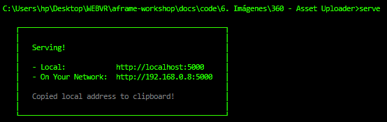
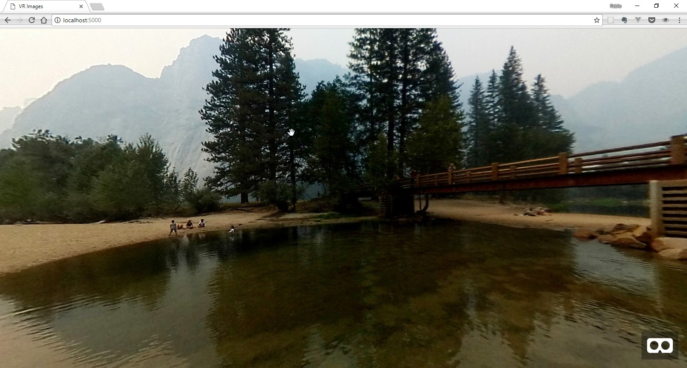
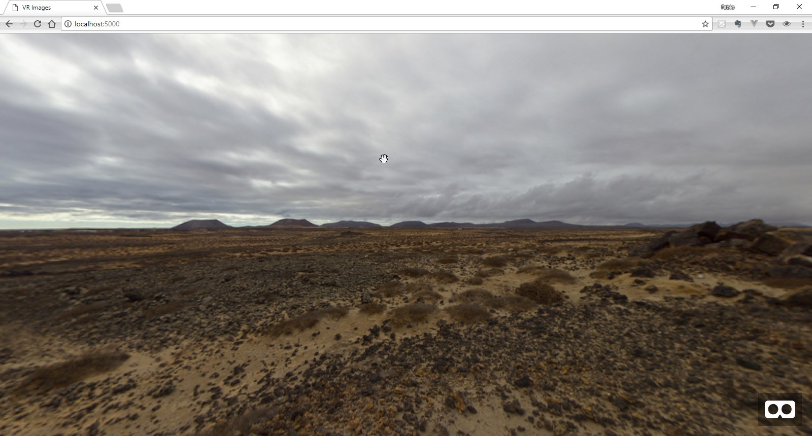
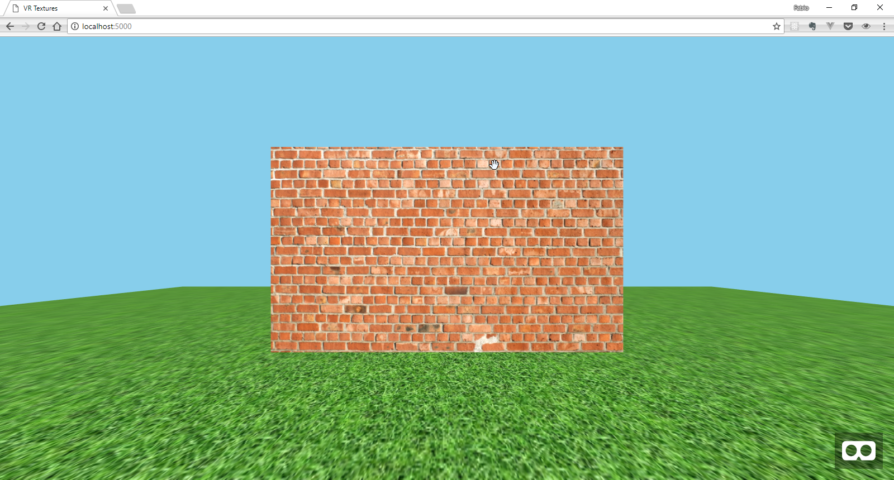

# :camera: Imágenes

Aplicaciones como videojuegos o experiencias 3D de calidad, generalmente precargan sus assets como modelos o texturas antes de hacer el render de las escenas. De esta manera, se asegura que los assets son visibles cuando se requieran, mejorando así el rendimiento y la experiencia de usuario al no descargarlos durante el proceso de render.

Por esta razón, A-Frame tiene un sistema de manejo de assets que nos permite ubicarlos en un solo lugar, para precargarlos y almacenarlos en el cache de la aplicación para mejorar el rendimiento.

## Asset Management System
El [sistema de manejo de assets](https://aframe.io/docs/0.8.0/core/asset-management-system.html) de A-frame, nos permite ubicar todos estos archivos dentro de la etiqueta `<a-assets>` que a su vez debe ir dentro de nuestra `<a-scene>`.

Los assets pueden ser:

* **a-asset-item:** Assets varios como modelos 3D y materiales.
* **audio:** Archivos de audio.
* **img:** Archivos de imagen.
* **video:** Archivos de video.

Para utilizar estos archivos, debemos definirlos en `<a-assets>` y apuntar a ellos usando selectores. Por ejemplo:

```html
<a-scene>
  <!-- Asset management system. -->
  <a-assets>
    <a-asset-item id="horse-obj" src="horse.obj"></a-asset-item>
    <a-asset-item id="horse-mtl" src="horse.mtl"></a-asset-item>
    <a-mixin id="giant" scale="5 5 5"></a-mixin>
    <audio id="neigh" src="neigh.mp3"></audio>
    
    <video id="kentucky-derby" src="derby.mp4"></video>
  </a-assets>

  <!-- Scene. -->
  <a-plane src="#advertisement"></a-plane>
  <a-sound src="#neigh"></a-sound>
  <a-entity geometry="primitive: plane" material="src: #kentucky-derby"></a-entity>
  <a-entity mixin="giant" obj-model="obj: #horse-obj; mtl: #horse-mtl"></a-entity>
</a-scene>
````

La escena no será renderizada o inicializada hasta que el navegador haya descargado todos los assets o hasta que el sistema de archivos alcance un tiempo límite.

### CORS: Cross-Origin Resource Sharing
Debido a que A-Frame carga los assets usando[XHRs](#point_right-aclaraciones), se requiere por motivos de seguridad que el navegador sirva los archivos con [headers CORS](#point_right-aclaraciones) si el asset está en un dominio diferente, de lo contrario tendríamos que almacenar dichos assets en el mismo origen que la escena.

Una opción, es usar [GitHub Pages](https://pages.github.com/) como plataforma para desplegar nuestras escenas, ya que todos los archivos los sirven con headers CORS.

También podemos utilizar el [A-Frame Asset Uploader](https://cdn.aframe.io/), que nos permite servir archivos estáticos con los respectivos headers. De esta manera, `<a-assets>` ajustará los atributos `crossorigin` en los assets si detecta que están en un dominio diferente.

## Imágenes en A-Frame
Existen básicamente tres formas de utilizar imágenes en A-Frame:

* Imágenes equirectangulares o 360
* Texturas
* Imágenes posicionales

### Imágenes equirectangulares
Una imagen equirecatngular o panorámica, es aquella que al ser proyectada de forma esférica nos rodea 360° a lo largo del horizonte, 90° hacia arriba y 90° hacia abajo. Estas imágenes tienen una proporción ancho:alto de 2:1.

En A-Frame, contamos con la primitiva `<a-sky>` que nos permite agregar un color de fondo como ya vimos anteriormente, o una imagen 360 a nuestra escena, como veremos a cotninuación. Básicamente, un [sky](https://aframe.io/docs/0.8.0/primitives/a-sky.html#example) es una gran esfera con un color o una textura mapeada hacia adentro.

En este punto ya es conveniente empezar a desarrollar nuestras escenas de manera local en un editor de texto como [Atom](https://atom.io/), [Sublime Text](https://www.sublimetext.com/) o [VS Code](https://code.visualstudio.com/).

Pare el primer primer ejemplo utilizaremos el [A-Frame Asset Uploader](https://cdn.aframe.io/) para cargar una imagen en nuestra escena. Lo único que debemos hacer es subir una imagen y obtendremos un enlace que sirve nuestro archivo con los headers adecuados.

Podemos encontrar una imagen para este ejercicio en el grupo de flickr [equirectangular](https://www.flickr.com/groups/equirectangular/). Allí, miles de personas alrededor del mundo comparten sus fotografías 360, solo debemos buscar una que tenga licencia Creative Commons y la descargamos.

Una vez tenemos lista la imagen, debemos cargarla en el Asset Uploader y allí obtendremos el link a la imagen.

Ahora bien, en nuestro editor de texto favorito, debemos crear un archivo HTML tradicional. Allí, en la parte superior del Body, debemos agregar el script de A-Aframe y posteriormente nuestra `<a-scene>`

```html
<!DOCTYPE html>
<html lang="en" dir="ltr">
<head>
  <meta name="viewport" content="width=device-width, initial-scale=1, maximum-scale=1">
  <meta charset="utf-8">
  <title>VR Images</title>
</head>
  <body>
    <script src="https://aframe.io/releases/0.8.0/aframe.min.js"></script>
    <a-scene>
      <!-- here goes the  VR scene -->
    </a-scene>
  </body>
</html>
````

Ahora debemos agregar el asset que queremos cargar en nuestra escena. Para ello, debemos agregar el tag `<a-assets>` y dentro de él, debemos incluir la etiqueta `` con los respectivos atributos. En `id` escribiremos el selector con el cual apuntaremos a la imagen, y en `src` el link que obtuvimos del Asset Uploader.

```html
...
<a-scene>
  <a-assets>
    
  </a-assets>
  <a-sky src="#river"></a-sky>
</a-scene>
...
````

Si al abrir el archivo .html en el navegador, no puedes ver la imagen sino que ves todo el fondo negro, es probable que el error sea al servir el archivo por CORS. Puedes verificarlo abriendo las herramientas para desarrolladores del navegador (CTRL + Shift + I) y en la pestaña de Consola, deberías ver el error que indica el problema de CORS. En este caso, lo que debemos hacer es correr nuestro proyecto en un servidor, de esta manera los assets se cargarán adecuadamente y podremos ver la escena correctamente.

A-Frame no requiere ninguna configuración especial para el servidor, así que si ya tienes algún servidor corriendo en tu computador (Apache, Nginx etc.) puedes ubicar allí tu archivo index.html y deberá funcionar correctamente. Si no cuentas con uno de estos servidores, una opción muy sencilla es utilizar el paquete de Node llamado `serve`.

Para utilizarlo debes tener instalado Node.js y el gestor de paquetes npm. Puedes instalarlo descargando el archivo correspondiente a tu sistema operativo en este [enlace](https://nodejs.org/en/download/). Al instalar Node.js también se instala npm, así que ya puedes empezar a utilizar todos los paquetes que desees.

Ahora, debes abrir la terminal de tu computadora e instalar `serve` con el siguiente comando:

```
$ npm install -g serve
```

La bandera -g indica que el paquete se instalará de forma global, así que podrás usarlo en cualquier ubicación de tu computador.

Finalmente, en la terminal debes ubicarte en la carpeta donde tengas el archivo index.html del proyecto y allí correr el siguiente comando:

```
$ serve
```

Si todo salió bien, deberías ver un mensaje como este:

<p align="center">
 
</p>

Lo que indica que ya esta corriendo el servidor y puedes ver la escena de VR en la dirección que allí se indica.

<p align="center">

</p>

Ahora, en lugar de cargar la imagen 360 desde el CDN de A-frame, vamos a utilizar un archivo almacenado de manera local. Para esto, crearemos una carpeta llamada assets junto a nuestro index.html y allí guardaremos otra imagen 360.

Una vez que ya tenemos nuestra imagen lista en la carpeta 'assets', debemos incluirla dentro de nuestros `<a-assets>`. En el atributo src debemos especificar la ruta de la imagen que queremos utilizar como vemos a continuación:

```html
...
<a-scene>
  <a-assets>
    
    
  </a-assets>
  <a-sky src="#desert"></a-sky>
</a-scene>
...
```

Luego, simplemente debemos recargar el navegador y allí estará nuestra nueva imagen.

<p align="center">

</p>

### Texturas
Une textura es una imagen que se utiliza para cubrir la superficie de un objeto virtual, ya sea tridimensional o bidimensional. De esta manera, podemos aplicar texturas a las entidades que incluyamos en nuestra escena incluyendo los assets correspondientes.

Para este ejercicio, vamos a crear un nueva carpeta, que incluirá nuevamente un `index.html` y la carpeta `assets`.

Nuevamente, en el `index.hmtl` debemos agregar el script de A-Aframe y posteriormente nuestra `<a-scene>`:

```html
<!DOCTYPE html>
<html lang="en" dir="ltr">
<head>
  <meta name="viewport" content="width=device-width, initial-scale=1, maximum-scale=1">
  <meta charset="utf-8">
  <title>VR Images</title>
</head>
  <body>
    <script src="https://aframe.io/releases/0.8.0/aframe.min.js"></script>
    <a-scene>
      <!-- here goes the  VR scene -->
    </a-scene>
  </body>
</html>
````

Ahora, dentro del `<a-scene>`, debemos incluir el tag `<a-assets>` y dentro de él, debemos incluir la etiqueta `` que hará referencia a las imágenes que vayamos a utilizar como texturas. En este caso, vamos a utilizar un par de imágenes .jpg como texturas de ladrillos y de césped, que puedes encontrar [aquí](https://github.com/fcor/aframe-workshop/tree/master/docs/code/6.%20Im%C3%A1genes/texturas/assets).

```html
...
<a-scene>
  <a-assets>
    
    
  </a-assets>
</a-scene>
...
```

Una vez incluídos los assets correspondientes, vamos a agregar un par de primitivas a las cuales les vamos a aplicar las texturas. La primera, será un `<a-box>`. A esta entidad le debemos asignar en el atributo src el ID de la textura que le queramos aplicar, así como una posición en la escena y sus respectivas dimensiones:

```html
...
<a-scene>
  <a-assets>
    
    
  </a-assets>
  <a-box src="#pared" position="0 1.5 -5" width="6" depth="1" height="4"></a-box>
</a-scene>
...
```

La otra primitiva que vamos a agregar es un `<a-plane>`. Por defecto, este plano esta orientado de forma paralela al eje XY, así que para utilizarlo como un suelo en nuestra escena debemos orientarlo sobre el eje XZ aplicando una rotación de -90° en ele eje x.

```html
...
<a-plane rotation="-90 0 0"></a-plane>
...
```

Adicionalmente, queremos que este suelo sea lo suficientemente grande, así que debemos incrementar su ancho y su alto, por ejemplo a 30m.

```html
...
<a-plane width="30" height="30" rotation="-90 0 0"></a-plane>
...
```

Para aplicar la textura, agregamos en el atributo `src` el ID del asset correspondiente. Para cubrir toda el área de `<a-plane>` con la textura, debemos utilizar el atributo `repeat`. Esta propiedad acepta dos valores, el número de veces a repetir la textura en el eje X, y el número de veces a repetri la textura en el eje Y.

```html
...
<a-plane src="#suelo" width="30" height="30" repeat="10 10" rotation="-90 0 0"></a-plane>
...
```

Finalmente, corremos el comando `serve` en la carpeta del proyecto y deberíamos ver nuestra escena.

<p align="center">

</p>


### Imágenes posicionales
___
### :point_right: Aclaraciones
>XHRs:
>CORS:

### 📝 [Solución]()

[⏪](https://github.com/fcor/aframe-workshop/blob/master/ex/5.md)  [⏩](https://github.com/fcor/aframe-workshop/blob/master/ex/7.md)
