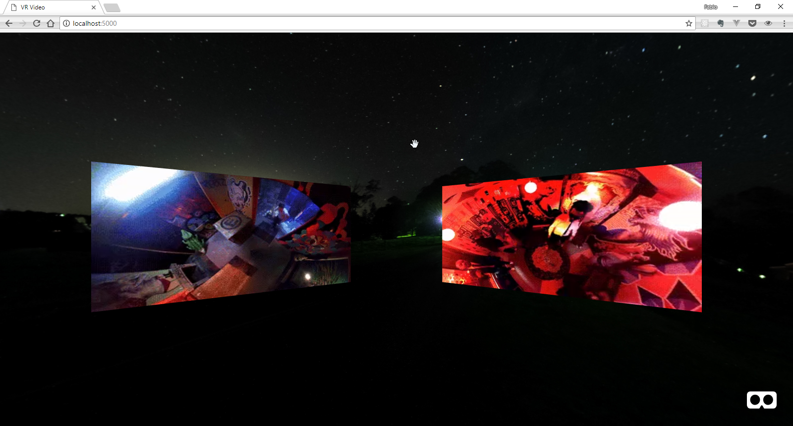

# :video_camera: Video

Existen dos formas de incluir videos en una escena de VR:

* Video plano
* Video 360

## Video plano
Para incluir archivos de video tradicionales, existe la primitiva `<a-video>`. Esta primitiva permite reproducir un video como textura en un plano liso.

Para este ejercicio, vamos a crear un nueva carpeta, que incluirá nuevamente un `index.html` y la carpeta `assets`.

Nuevamente, en el `index.hmtl` debemos agregar el script de A-Aframe y posteriormente nuestra `<a-scene>`:

```html
<!DOCTYPE html>
<html lang="en" dir="ltr">
<head>
  <meta name="viewport" content="width=device-width, initial-scale=1, maximum-scale=1">
  <meta charset="utf-8">
  <title>VR Images</title>
</head>
  <body>
    <script src="https://aframe.io/releases/0.8.0/aframe.min.js"></script>
    <a-scene>
      <!-- here goes the  VR scene -->
    </a-scene>
  </body>
</html>
````

Ahora, dentro de nuestra escena, vamos a incluir el Asset management system, en el cual vamos a referenciar un par de videos y una imagen 360 para utilizar en un `<a-sky>`. En los atributos de los videos, debemos especificar las propiedades de `autoplay` y `loop` para que los videos se reproduzcan automáticamente y en bucle.

```html
...
<a-scene>
  <a-assets>
    <video id="video1" autoplay loop="true" src="assets/1.mp4"></video>
    <video id="video2" autoplay loop="true" src="assets/2.mp4"></video>
    
  </a-assets>

  <a-sky src="#night"></a-sky>
</a-scene>
...
```

Ahora, debemos añadir los videos a la escena. Para ello, utilizaremos la primitiva [<a-video>](https://aframe.io/docs/0.8.0/primitives/a-video.html). Allí, debemos especificar el ID de los videos, así como la posición y una pequeña rotación de 30 grados. Tal como en las imágenes, se recomienda especificar el ancho y el alto de la imagen, manteniendo la proporción original, para evitar que se distorsione.

```html
<a-video src="#video1" width="3.57" height="2" position="-2.5 1.5 -4" rotation="0 30 0"></a-video>
<a-video src="#video2" width="3.57" height="2" position="2.5 1.5 -4" rotation="0 -30 0"></a-video>
```

Finalmente, nuestra debería verse así:

<p align="center">

</p>

### 📝 [Solución]()

[⏪](https://github.com/fcor/aframe-workshop/blob/master/ex/6.md)  [⏩](https://github.com/fcor/aframe-workshop/blob/master/ex/8.md)
