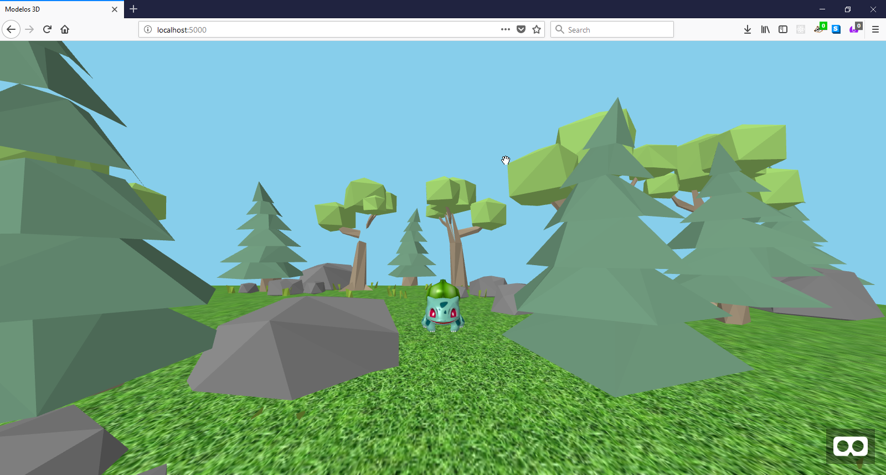

# :computer: Modelos 3D
A-Frame tiene componentes para cargar archivos de 3D de tipo [glTF](https://aframe.io/docs/0.8.0/components/gltf-model.html), [OBJ](https://aframe.io/docs/0.8.0/components/obj-model.html) y [COLLADA](https://aframe.io/docs/0.8.0/components/collada-model.html). Sin embargo, es posible escribir componentes que puedan manejar prácticamente cualquier formato, por ejemplo PLY, FBX, JSON o three.js que ya han sido creados por la comunidad.

## Dónde encontrar modelos 3D?
Estos son algunos sitios donde se pueden encontrar modelos en diferentes formatos:

* [Sketchfab](https://sketchfab.com/)
* [Clara.io](https://clara.io/)
* [Archive3D](https://archive3d.net/)
* [Sketchup's 3D Warehouse](https://3dwarehouse.sketchup.com/)
* [Turbosquid](https://www.turbosquid.com/Search/3D-Models/free)

## Cómo crear modelos 3D?
Estos son algunos programas para crear modelos 3D:

* [Blender](https://www.blender.org/)
* [MagicaVoxel](https://ephtracy.github.io/)
* [Maya](https://www.autodesk.com/products/maya/overview)
* [Cinema4D](https://www.maxon.net/en-us/)

## Cómo usar modelos 3D en A-Frame
Una vez que hayamos creado o descargado nuestros modelos 3D, podemos usarlos como assets en nuestras escenas de VR.

Para este ejercicio, vamos a crear un nueva carpeta, que incluirá nuevamente un `index.html` y la carpeta `assets`.

Nuevamente, en el `index.hmtl` debemos agregar el script de A-Aframe y posteriormente nuestra `<a-scene>`:

```html
<!DOCTYPE html>
<html lang="en" dir="ltr">
<head>
  <meta name="viewport" content="width=device-width, initial-scale=1, maximum-scale=1">
  <meta charset="utf-8">
  <title>Modelos 3D</title>
</head>
  <body>
    <script src="https://aframe.io/releases/0.8.2/aframe.min.js"></script>
    <a-scene>
      <!-- here goes the  VR scene -->
    </a-scene>
  </body>
</html>
````

Ahora, dentro de nuestra escena, vamos a incluir el Asset management system, en el cual vamos a referenciar algunos [assets](https://github.com/fcor/aframe-workshop/tree/master/docs/code/8.%203D/assets) 3D. Ene stos archivos encontramos un .dae, que es un modelo 3D tipo COLLADA, un archivo .obj con su respectiva textura .mtl que utiliza los dos archivos .png y finalmente la textura de césped que usamos en uno de los ejercicios anteriores.

Los archivos 3D se referencian como `<a-asset-item>` y dentro del atributo `src` se debe especificar la ruta del archivo. Para los assets de tipo OBJ, es necesario incluir tanto el .obj como el .mtl:

```html
...
<a-scene>
  <a-assets>
    
    <a-asset-item src="assets/bosque.dae" id="bosque"></a-asset-item>
    <a-asset-item id="bulbasaur-obj" src="assets/bulbasaur-pokemon-go.obj"></a-asset-item>
    <a-asset-item id="bulbasaur-mtl" src="assets/bulbasaur-pokemon-go.mtl"></a-asset-item>
  </a-assets>
</a-scene>
...
```

Una vez cargados los assets, debemos incluirlos en la escena. Empezamos agregando un `<a-plane>` para el suelo, utilizando la textura de césped que cargamos previamente. Luego, añadimos un `<a-sky>` de color "skyblue" para dar un mejor ambiente a la escena, y finalmente los assets 3D utilizando el tag `<a-entity>` especificando el tipo de modelo a cargar.

Los modelos 3D de tipo [OBJ](https://aframe.io/docs/0.8.0/components/obj-model.html) deben especificar la ruta del modelo .obj y de la textura .mtl respectivamente:

```html
<a-entity obj-model="obj: #bulbasaur-obj; mtl: #bulbasaur-mtl" position="0 0 -6" scale="0.15 0.15 0.15"></a-entity>
```

A su vez, los objetos de tipo [COLLADA](https://aframe.io/docs/0.8.0/components/collada-model.html), deben especificar la ruta del modelo.

```html
<a-entity collada-model="#bosque"></a-entity>
```

Finalmente, así debería ser el código completo de la escena:

```html
...
<a-scene>
  <a-assets>
    
    <a-asset-item src="assets/bosque.dae" id="bosque"></a-asset-item>
    <a-asset-item id="bulbasaur-obj" src="assets/bulbasaur-pokemon-go.obj"></a-asset-item>
    <a-asset-item id="bulbasaur-mtl" src="assets/bulbasaur-pokemon-go.mtl"></a-asset-item>
  </a-assets>

  <a-plane src="#suelo" width="30" height="30" repeat="10 10" rotation="-90 0 0"></a-plane>
  <a-sky color="skyblue"></a-sky>
  <a-entity obj-model="obj: #bulbasaur-obj; mtl: #bulbasaur-mtl" position="0 0 -6" scale="0.15 0.15 0.15"></a-entity>
  <a-entity collada-model="#bosque"></a-entity>
</a-scene>
...
```

Y corriendo el servidor, la escena debería verse así:

<p align="center">

</p>

### 📝 [Solución](https://github.com/fcor/aframe-workshop/tree/master/docs/code/8.%203D)

[⏪](https://github.com/fcor/aframe-workshop/blob/master/ex/7.md)  [⏩](https://github.com/fcor/aframe-workshop/blob/master/ex/9.md)
